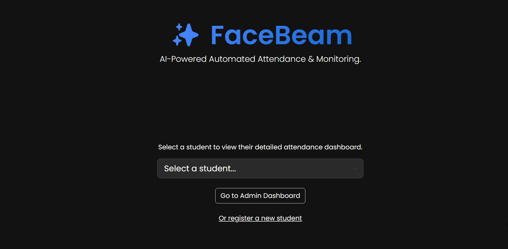
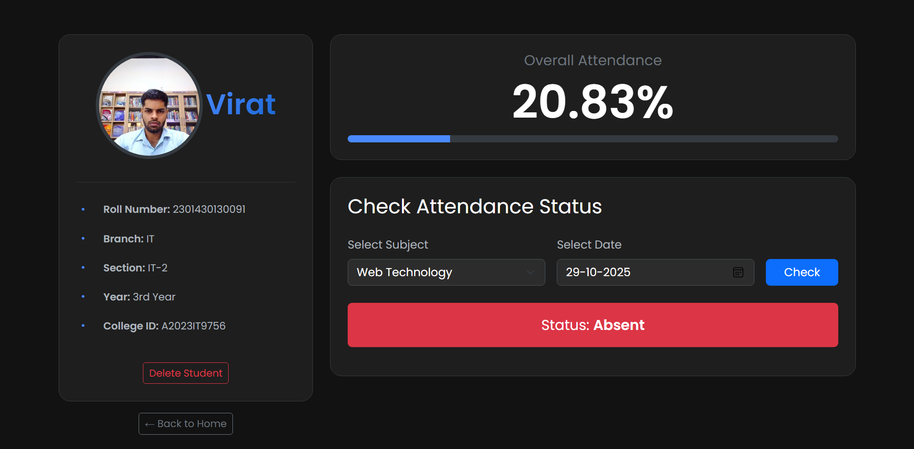

# Heading 1
✨ FaceBeam: AI-Powered Automated Attendance System

FaceBeam is an intelligent system designed to automate student attendance using real-time facial recognition, synchronized with the official class timetable. It aims to replace inefficient manual attendance methods with a faster, more accurate, and secure solution.
## Screenshots

**Homepage (Student Selection):**
 
*A portal to select a student.*

**Student Dashboard:**
 
*Shows student details, attendance percentage, and status checker.*

**Admin Dashboard:**
 
*Displays live class information and current absentees.*

# Heading 2
Problem Solved

Traditional attendance methods suffer from:

- Item 1 
Time Consumption: Manual roll calls waste valuable lecture time.
- Item 2
Inaccuracy: Human errors in marking and data entry.
-Item 3
Proxy Attendance: Students marking attendance for absent friends.
- Item 4
Lack of Analysis: Difficulty in tracking attendance patterns.

FaceBeam addresses these issues by leveraging AI for automated and reliable attendance logging.
# Heading 2
Features
# Heading 3
Real-time Facial Recognition: Detects and identifies multiple students simultaneously using a webcam.
# Heading 3
Automated Attendance Logging: Records attendance directly into an SQLite database.
# Heading 3
Timetable Synchronization: Ensures attendance is marked only during scheduled class times and linked to the correct subject.
# Heading 3
Student Dashboard: A web interface to view individual student details (photo, admission info) and check their attendance status (Present/Absent) for specific subjects and dates.
# Heading 3
Attendance Analytics: Calculates and displays overall attendance percentage for each student.
# Heading 3
Admin Dashboard: A live view showing the current class in session and a list of students absent from that class.
# Heading 2
Technology Stack

Backend: Python 3.11, Flask

AI/Computer Vision: face_recognition library, OpenCV (opencv-python)

Database: SQLite 3

Frontend: HTML, CSS, Bootstrap 5, JavaScript

Charting: Chart.js (for student dashboard chart, if implemented)

Development Tools: VS Code, Git, GitHub
# Heading 2
Setup and Installation

Follow these steps to set up the project locally:

Clone the repository:

git clone [https://github.com/Jat-droid/FaceBeam.git](https://github.com/Jat-droid/FaceBeam.git)
cd FaceBeam

Create and activate a virtual environment:

# Ensure you have Python 3.11 installed
python -m venv venv
# On Windows (cmd/powershell):
.\venv\Scripts\activate
# On Windows (Git Bash):
# source venv/Scripts/activate
# On macOS/Linux:
# source venv/bin/activate

Install dependencies:

Crucial: Make sure you have CMake and C++ build tools installed first (see project setup discussions).

Then, install the required Python packages:

pip install Flask opencv-python face_recognition numpy Pillow chart.js # Add other libraries if used

Prepare Known Faces:

Place clear .jpg or .png images of students in the known_faces folder.

Rename the image files to match the student's full name in lowercase with underscores instead of spaces (e.g., virat_sirohi.jpg).

Set up the Database:

Run the database population script once to create the facebeam.db file and set up the tables and timetable:

python populate_database.py

(Alternatively, run the database_setup.py and then manually add timetable/subject data using DB Browser for SQLite)

Use DB Browser for SQLite to add/edit student admission details in the students table if needed.

Usage

You need to run two components simultaneously in separate terminals:

Terminal 1: Start the Web Server

python app.py

Access the web interface at http://127.0.0.1:5000.

Terminal 2: Start the Recognition Script

python recognize.py

This will open the webcam window and start logging attendance based on the schedule.

Future Scope

Implement a secure login system for the Admin Dashboard.

Add features to manage subjects and the timetable directly via the web interface.

Integrate email notifications for absentees.

Enhance AI with liveness detection or engagement analysis.

Deploy the application to a cloud platform for live access.