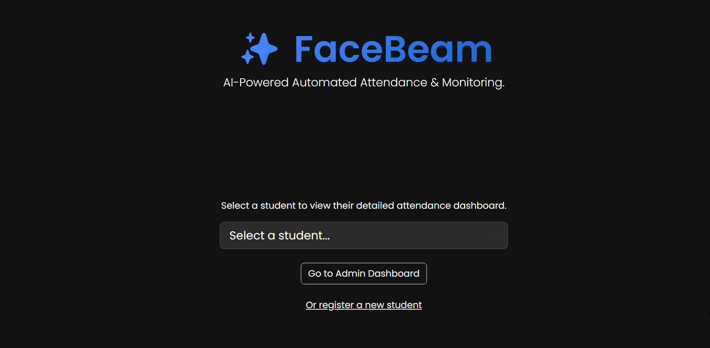
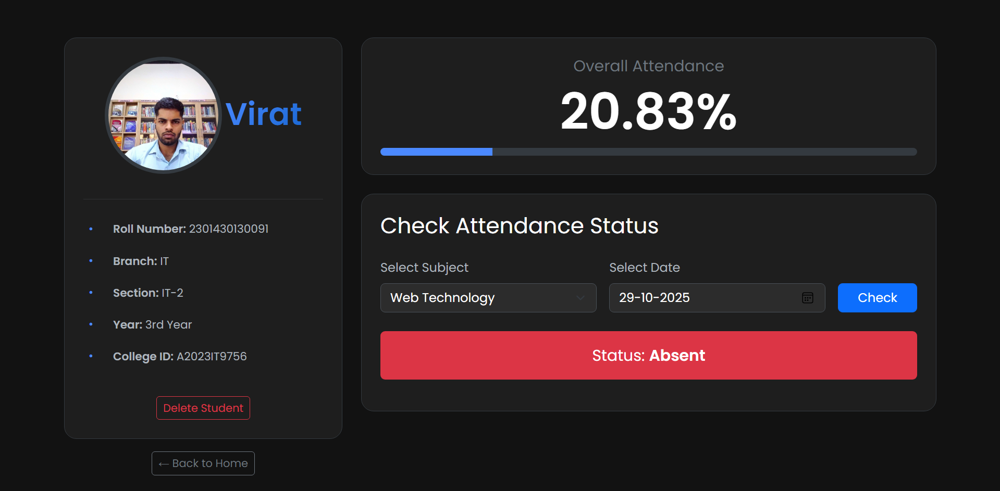
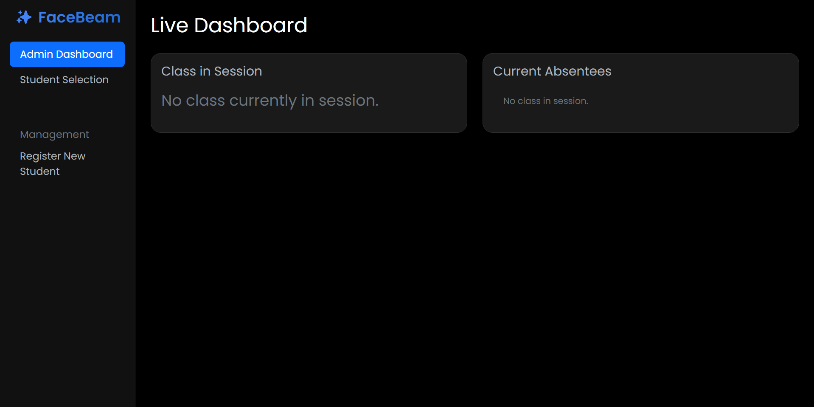

# ✨ FaceBeam: Edge-to-Cloud AI Automated Attendance System

**Live Cloud Dashboard:** [https://jat.pythonanywhere.com](https://jat.pythonanywhere.com)  
**GitHub Repository:** [https://github.com/Jat-droid/FaceBeam](https://github.com/Jat-droid/FaceBeam)

FaceBeam is a custom-built, hardware-to-cloud AI pipeline designed to automate student attendance using real-time facial recognition. It utilizes a local edge device (laptop webcam) to process facial recognition locally, and upon recognizing a registered student, it fires a secure JSON payload across the internet to a live Flask cloud server.

## 📸 Screenshots

**Homepage (Student Selection):**
 
*A portal to select a student or register a new one.*

**Student Dashboard:**
 
*Shows student details, attendance percentage, and status checker.*

**Admin Dashboard:**
 
*Displays live class information and current absentees.*

---

## 🎯 Problem Solved
Traditional attendance methods suffer from:
* **Time Consumption:** Manual roll calls waste valuable lecture time.
* **Inaccuracy:** Human errors in marking and data entry.
* **Proxy Attendance:** Students marking attendance for absent friends.
* **Lack of Analysis:** Difficulty in tracking attendance patterns.

FaceBeam addresses these issues by leveraging edge-computing AI for automated, foolproof, and reliable attendance logging.

---

## 🚀 Key Features
* **Edge-to-Cloud Architecture:** Heavy AI processing is done locally, keeping server costs near zero, while data is synced globally via a custom REST API.
* **Real-time Facial Recognition:** Detects and identifies multiple students simultaneously using a webcam and deep learning models.
* **Live Web Dashboard:** A live Flask view showing the current class in session, absentees, and individual student metrics.
* **Timetable Synchronization:** Ensures attendance is marked *only* during scheduled class times and linked to the correct subject to prevent false positives.
* **Web Registration Portal:** New students can register their details and capture their baseline face data directly through the web UI.

---

## 🛠️ Technology Stack

**Edge Device (Local AI Processing):**
* Python 3.10+
* `face_recognition` & `dlib` (Deep Learning models)
* OpenCV (`opencv-python`)
* `requests` (API communication)

**Cloud Server (Web & Database):**
* PythonAnywhere (uWSGI)
* Flask
* SQLite3
* HTML5, CSS3, Bootstrap 5, JavaScript

---

## ⚙️ Setup and Installation

### 1. Local Edge Device Setup
Clone the repository to the machine that will act as the camera/edge device:
```bash
git clone [https://github.com/Jat-droid/FaceBeam.git](https://github.com/Jat-droid/FaceBeam.git)
cd FaceBeam
Create and activate a virtual environment:

Bash
python -m venv venv
# On Windows:
.\venv\Scripts\activate
# On macOS/Linux:
source venv/bin/activate
Install required dependencies (includes specific versions to ensure face_recognition compatibility):

Bash
pip install -r requirements.txt
(Note: Ensure you have CMake and C++ build tools installed on your OS prior to installing dlib/face_recognition).

2. Cloud Server Setup (Optional for local testing)
If running entirely locally, start the Flask server in a separate terminal:

Bash
python database_setup.py
python populate_database.py
python app.py
Access the web interface at http://127.0.0.1:5000.

(To deploy to PythonAnywhere, clone this repository to the cloud environment, run the database setup scripts, and configure the WSGI file to point to app.py using absolute paths).

📡 Usage: Connecting Edge to Cloud
Once your server is running (either locally or on a cloud host like PythonAnywhere), configure your edge device to point to the API.

Open recognize.py.

Update the CLOUD_API_URL to match your server domain:

Python
CLOUD_API_URL = "[https://yourdomain.pythonanywhere.com/api/log_attendance](https://yourdomain.pythonanywhere.com/api/log_attendance)"
Run the recognition script:

Bash
python recognize.py
The webcam will open, begin scanning for known faces, and automatically shoot attendance payloads to your live web dashboard based on the active timetable!

🔮 Future Scope
Implement a secure JWT/OAuth login system for the Admin Dashboard.

Add a web UI configuration page to manage subjects and the timetable (replacing the manual SQLite population script).

Integrate email/SMS notifications for absentees.

Enhance AI with liveness detection (anti-spoofing) or engagement analysis.